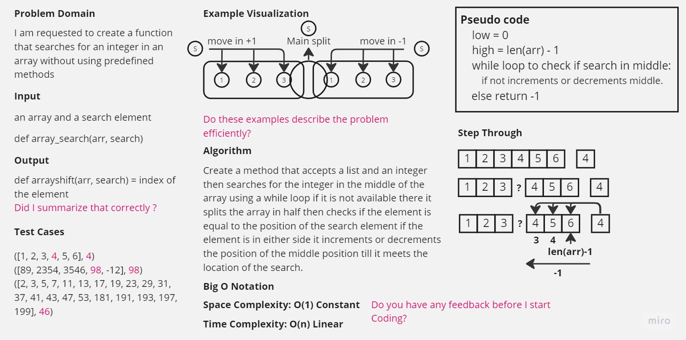

<<<<<<< HEAD
-[go back](../README.md)
# Code Challenge: Class 03 Array Search

## Whiteboard process
> Create a method that accepts a list and an integer then searches for the integer in the middle of the array using a while loop if it is not available there it splits the array in half then checks if the element is equal to the position of the search element if the element is in either side it increments or decrements the position of the middle position till it meets the location of the search.

## Approach and efficiency
> The algorithm takes a divide and conquer approach by splitting the list in half and recursively searching for the target element in either half, resulting in a time complexity of O(log n).
> The use of a while loop to iterate through the middle of the array allows for efficient searching, as it eliminates the need to check every element in the list.
> The algorithm relies on the assumption that the input list is sorted, as it searches for the target element by comparing it to the values at specific positions in the list.

## Solution
=======
### Code Challenge: Class 01

-[go back](../README.md)
>>>>>>> ad414837e738f3f51b4acd0e6bf61af11e382a08
