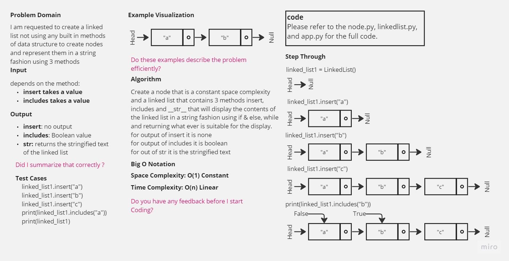

-[go back](../README.md)
# Code challenge: 05

# Challenge Title
Linked Lists

## Whiteboard Process

## Approach & Efficiency
not using built-in functions and methods to create a linked list of 3 objects a, b, and c.

## Solution
after defining the structure of the node and the linked list
3 methods were implemented:
- insert: which inserts a new node in the series
- includes: which searches for the node in the series by the value
- __str__: which returns the node in a string representation of the linked list

    {a} -> {b} -> {c} -> Null

