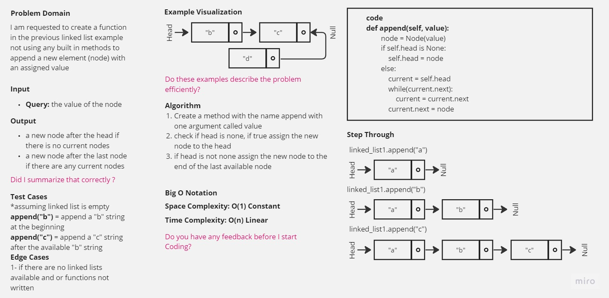
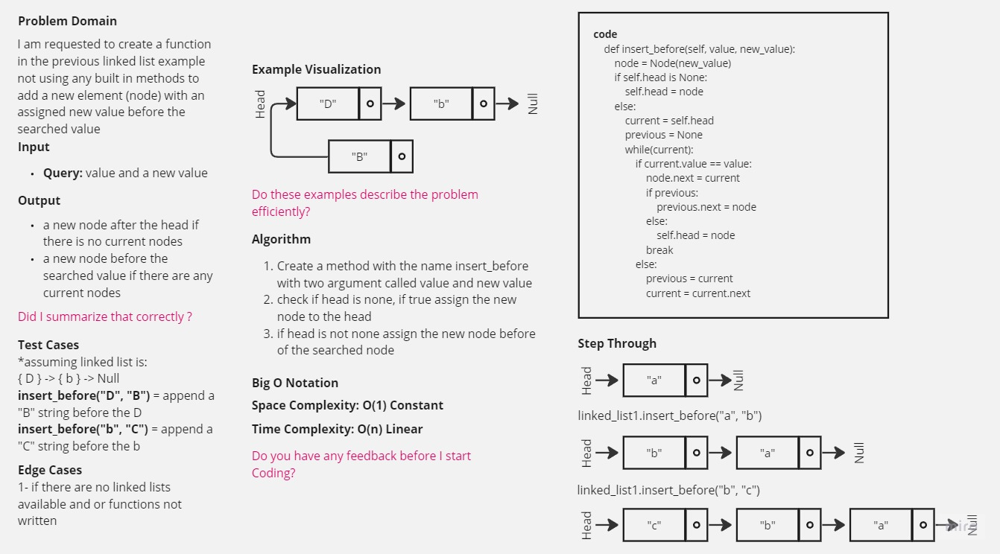
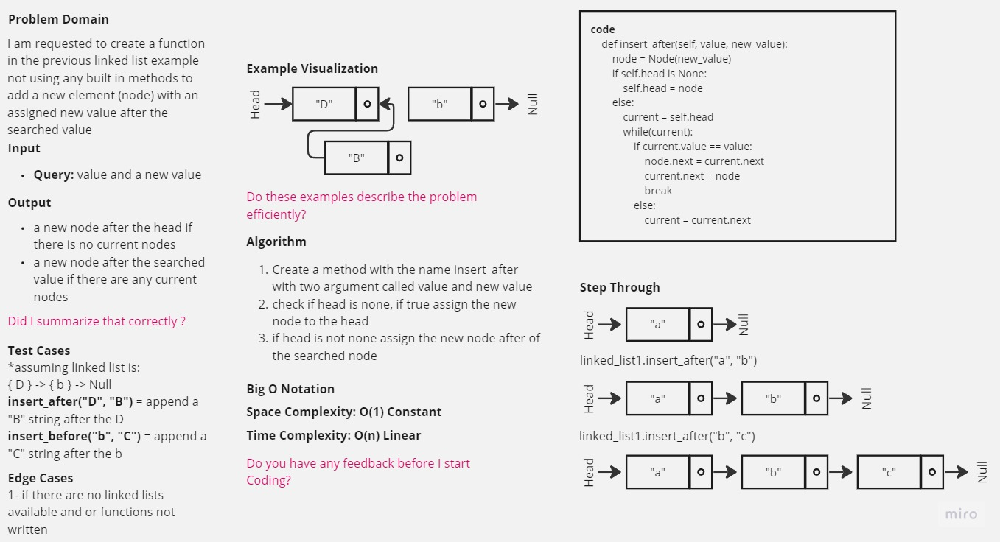

-[go back](../README.md)
# Code challenge: 06

# Challenge Title
Linked List Insertions

## Whiteboard Process

## Approach & Efficiency
not using built-in functions and methods to create new nodes to the created linked list in the previos code challenge.

## Solution
after defining the structure of the node and the linked list
3 methods were implemented:
- append: which inserts a new node in the series after the head if no head exists, or append to the end if there are nodes already in the series
- insert_before: which inserts a new node in the series after the head if no head exists, or searches for the value and appends a new node before the value
- insert_after: which inserts a new node in the series after the head if no head exists, or searches for the value and appends a new node after the value
