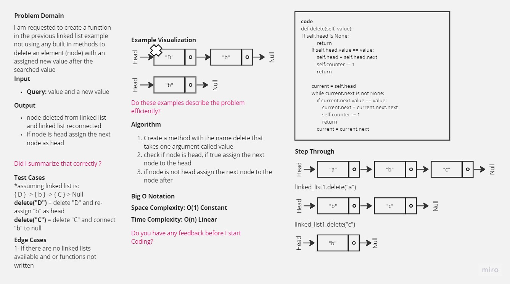
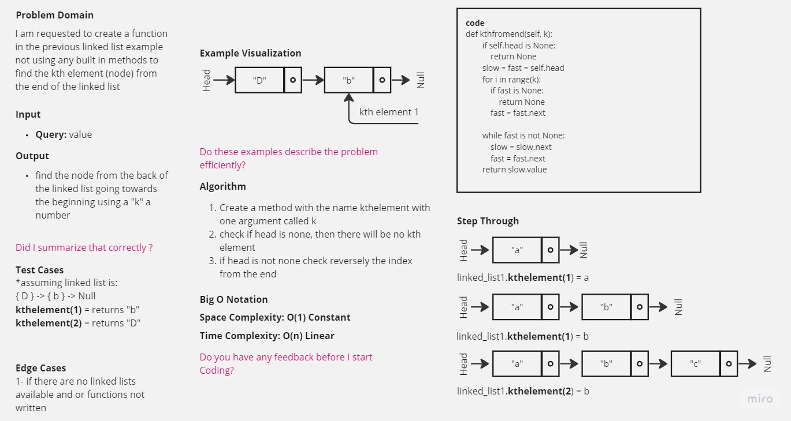

-[go back](../README.md)
# Code challenge: 07

# Challenge Title
Linked List delete and insertion

## Whiteboard Process

## Approach & Efficiency
not using built-in functions and methods to create new nodes to the created linked list in the previos code challenge.

## Solution
after defining the structure of the node and the linked list
2 methods were implemented:
- delete: by deleting from a linked list, you need to find the node with that value and update the pointers of the previous and next nodes to remove the node from the list.

- kthfromend: kthfromend is a function or method used to find the kth element from the end of a singly linked list or an array. In other words, if we consider the linked list or array as a sequence of elements, kthfromend returns the element that is k positions away from the end of the sequence.
