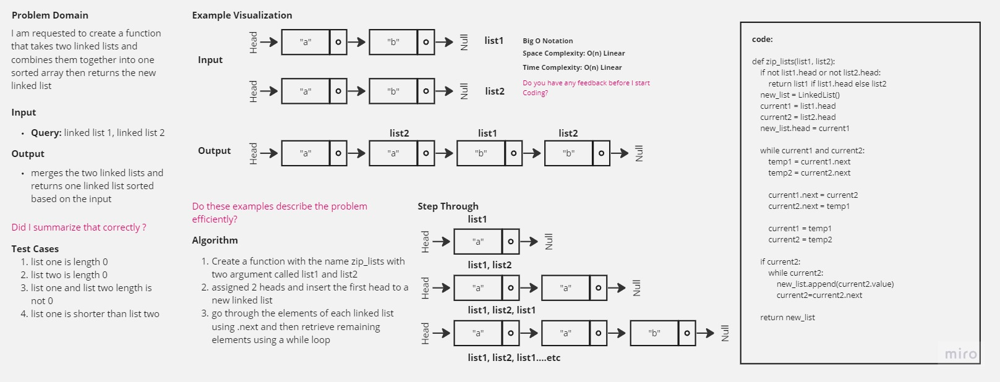

-[go back](../README.md)
# Code challenge: 08

# Challenge Title
zip lists

## Whiteboard Process

## Approach & Efficiency
not using built-in functions and methods to create a new linked list merged from two already created linked lists from the previous code challenges.

## Solution
after defining the structure of the node and the linked list
1 methods were implemented:
- zip_lists: merge the two lists into one linked list and return the resulting linked list using the __str__ method