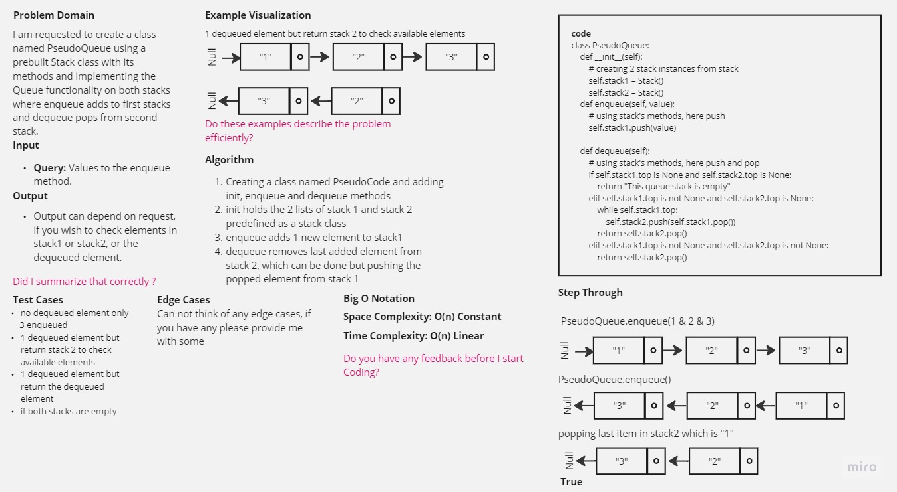

-[go back](../README.md)
# Code challenge: 11

# Challenge Title
Stack queue pseudo

## Whiteboard Process

## Approach & Efficiency

not using built-in functions and methods to create a new class called pseudo queue not using an existing Queue. But instead, this PseudoQueue class will implement our standard queue interface (the two methods listed below), Internally, utilize 2 Stack instances to create and manage the queue.

## Solution

after defining the structure of the stack queue:
- Methods:
> enqueue (Arguments: value)
Inserts a value into the PseudoQueue, using a first-in, first-out approach.

> dequeue (Arguments: none)
Extracts a value from the PseudoQueue, using a first-in, first-out approach.
