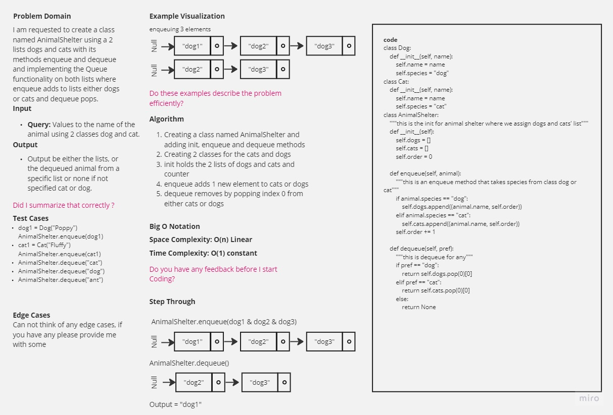

-[go back](../README.md)
# Code challenge: 12

# Challenge Title
Animal Shelter

## Whiteboard Process

## Approach & Efficiency

not using built-in functions and methods to create a new class called AnimalShelter not using an existing Queue. But instead, this Animal Shelter class will implement our standard queue interface (the two methods listed below), Internally, utilize 2 list instances to create and manage the queue.

## Solution

after defining the structure of the stack queue:
- Methods:
> enqueue (Arguments: value)
Inserts a value into the AnimalShelter, using a first-in, first-out approach.

> dequeue (Arguments: none)
Extracts a value from the AnimalShelter, using a first-in, first-out approach.
