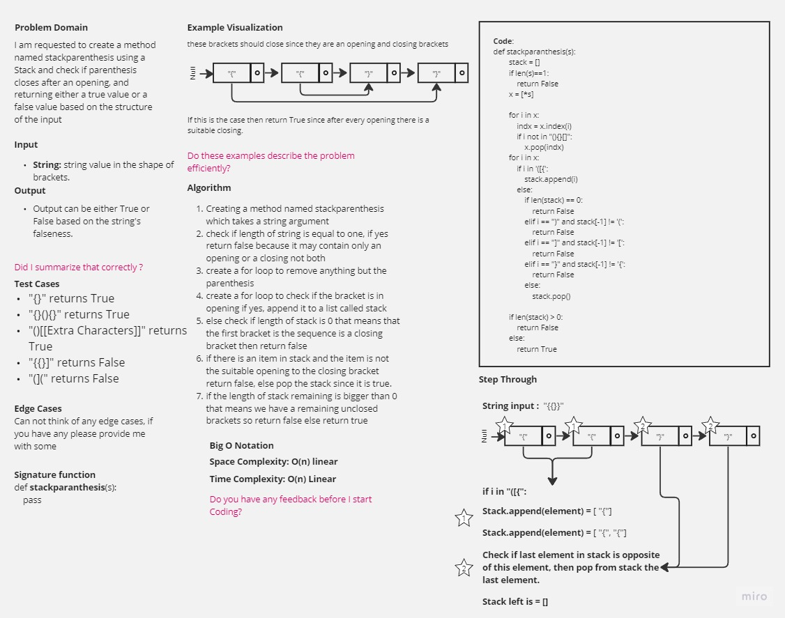

-[go back](../README.md)
# Code challenge: 13

# Challenge Title
stack-queue-bracket

## Whiteboard Process

## Approach & Efficiency

not using built-in functions and methods to create a new method called stack_paranthesis using a stack list to check if paranthesis closes after each other meaning [] is true [[ is false.

## Solution

after defining the structure of the stack:
- anything other than the brackets is ignored.
- check if the initial bracket is in opening, if not check if stack is empty then return false if stack is empty.
- if bracket not in opening, check if stack is empty if stack is empty return false, if not check if it matches the opening bracket, if not return false, if yes it matches pop the bracket from the stack.
- if length of string is one return false