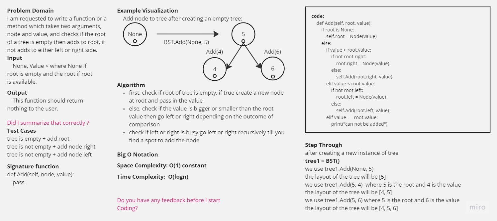
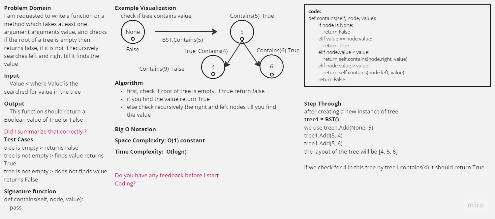
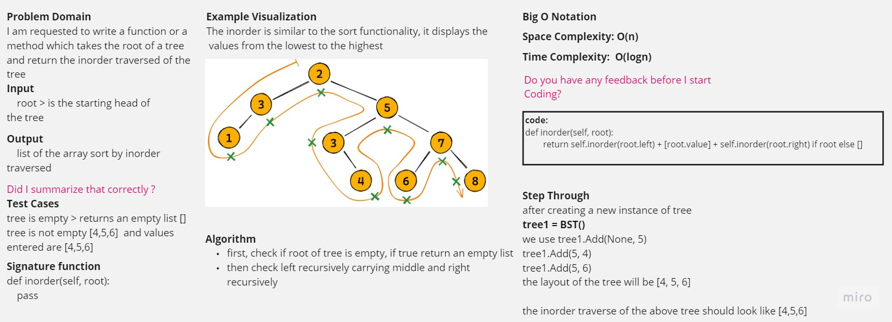
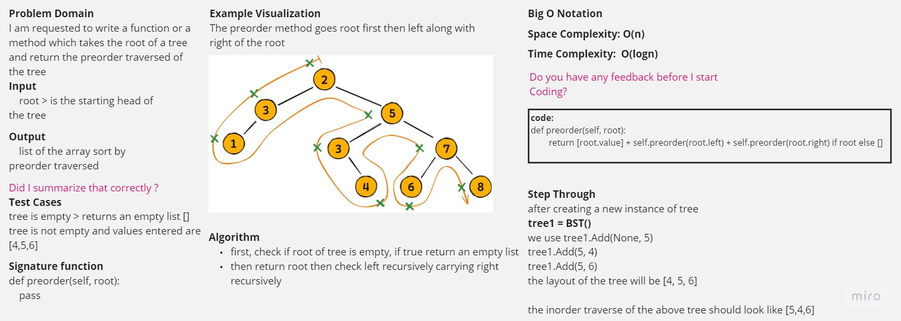
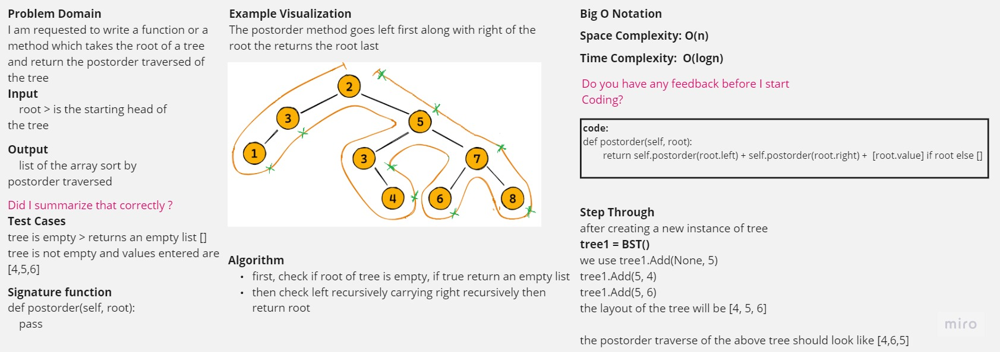

-[go back](../README.md)
# Code challenge: 15

# Challenge Title
Trees

## Whiteboard Process

## Approach & Efficiency

- create a tree class with 5 methods to initiate the tree, Add, Contains, inorder, preorder, postorder. where tree takes nodes and assigns the head if no head.

## Solution

after defining the structure of the tree:
- add method: is an O(log n) method which takes two arguments node and value
- contains method: is an O(log n) method which takes two arguments node and value
- preorder method: is an O(log n) method which takes one argument node
- inorder method: is an O(log n) method which takes one argument node
- postorder method: is an O(log n) method which takes one argument node