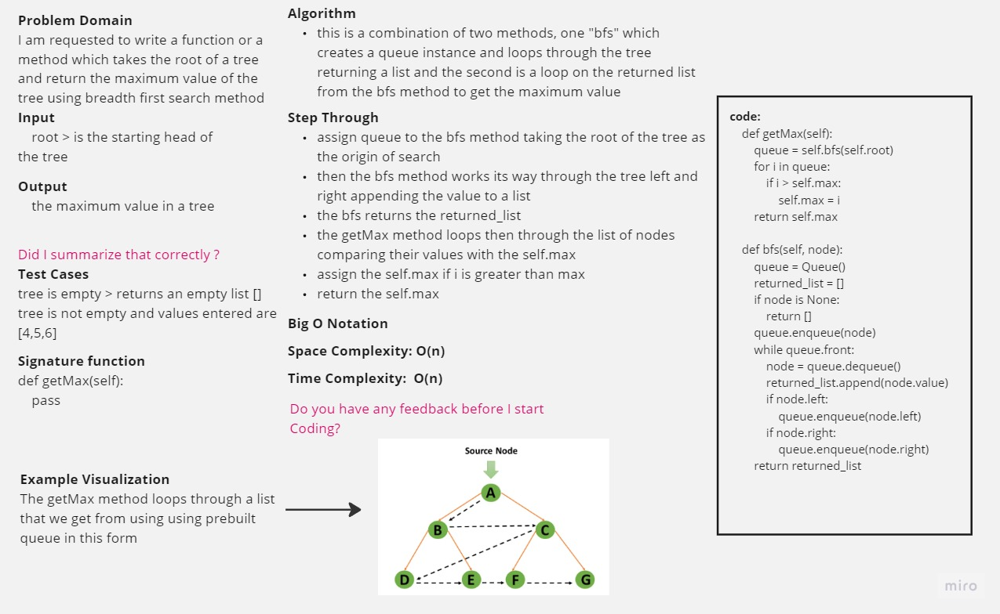

-[go back](../README.md)
# Code challenge: 16

# Challenge Title
BFS getMax

## Whiteboard Process

## Approach & Efficiency

- create a method that calculates the maximum value in a given tree

## Solution

after defining the structure of the tree:
- bfs method: is an O(n) method which takes one argument node
- getMax method: is an O(n) method which takes no arguments