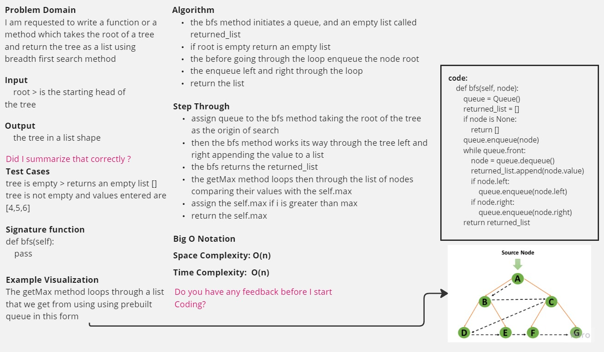

-[go back](../README.md)
# Code challenge: 17

# Challenge Title
BFS

## Whiteboard Process

## Approach & Efficiency

- create a method that retrieves the given tree as a list using breadth first search method

## Solution

after defining the structure of the tree:
- bfs method: is an O(n) method which takes one argument node