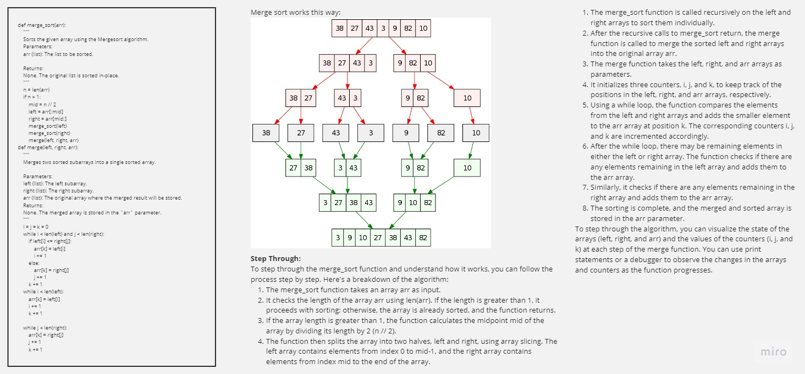

-[go back](../README.md)
# Code challenge: 27

# Challenge Title
merge sort

## Whiteboard Process

## Approach & Efficiency

- create a method that sorts a list using merge sort method

## Solution

after defining resolving some issues in the pseudo code:

    the Time Complexity is = O(NLogN)
    the Space Complexity is = O(N)