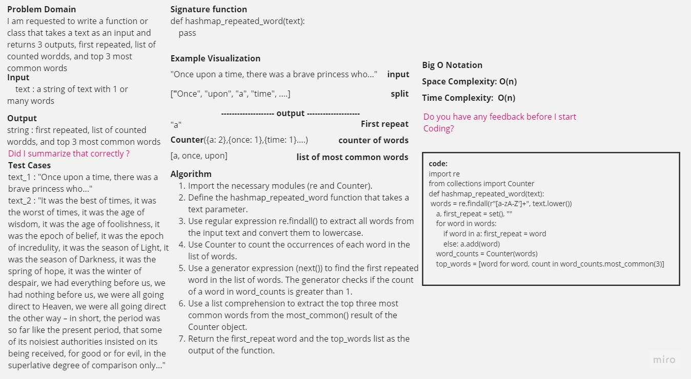

-[go back](../README.md)
# Code challenge: 31

## Challenge Title
Hashtable and methods

## Whiteboard Process

## Approach & Efficiency

create a hastable function that is similar to the hashmap and to check for cointing items in the given text

## Solution

### after defining the initial code:
hashmap_repeated_word_nescafe, hashmap_repeated_word, hashmap_repeated_word_counter, hashmap_repeated_word_top_three:

    the Time Complexity is = O(n)
    the Space Complexity is = O(n)
    