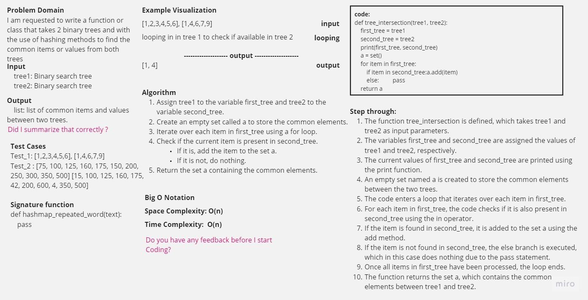

-[go back](../README.md)
# Code challenge: 32

## Challenge Title
Tree-intersection challenge

## Whiteboard Process

## Approach & Efficiency

create a hastable function that is similar to the hashmap and to check for commons in two binary trees

## Solution

### after defining the initial code:
tree_intersection:
    the Time Complexity is = O(n)
    the Space Complexity is = O(k)
    