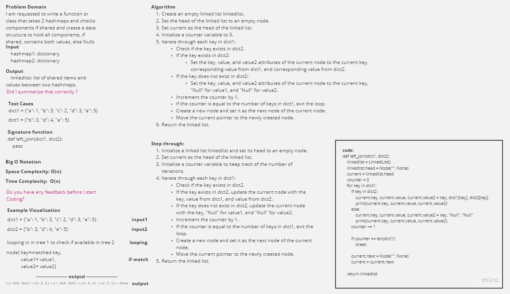

-[go back](../README.md)
# Code challenge: 33

## Challenge Title
Left join for two hashmaps

## Whiteboard Process

## Approach & Efficiency

create a hastable function that is similar to the hashmap and to merge two hashmaps into one data structure of choice

## Solution

### after defining the initial code:
hashmap_left_join:

    the Time Complexity is = O(n)
    the Space Complexity is = O(n)
    