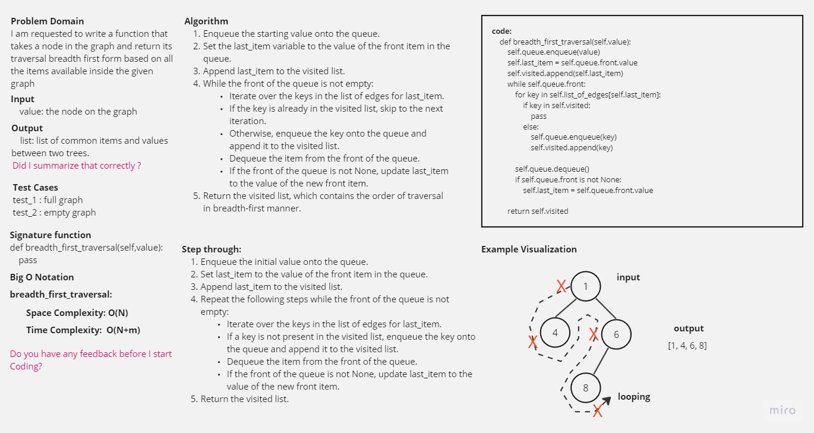

-[go back](../README.md)
# Code challenge: 36

## Challenge Title
Graph breadth first

## Whiteboard Process

## Approach & Efficiency

create and return a list of traversal breadth first order of the graph

## Solution

### after defining the initial code:
flatten:

    the Time Complexity is = O(n)
    the Space Complexity is = O(m)

breadth_first_graph:

    the Time Complexity is = O(n)
    the Space Complexity is = O(m)
