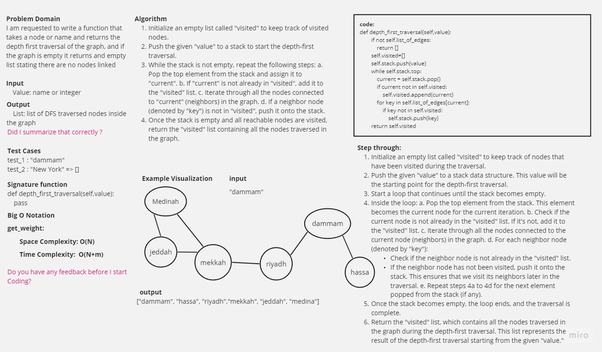

-[go back](../README.md)
# Code challenge: 38

## Challenge Title
Deph First Search

## Whiteboard Process

## Approach & Efficiency

create a function that returns the DFS of the graph 

## Solution

### after defining the initial code:
depth_first_graph:

    the Time Complexity is = O(N+m)
    the Space Complexity is = O(N)
